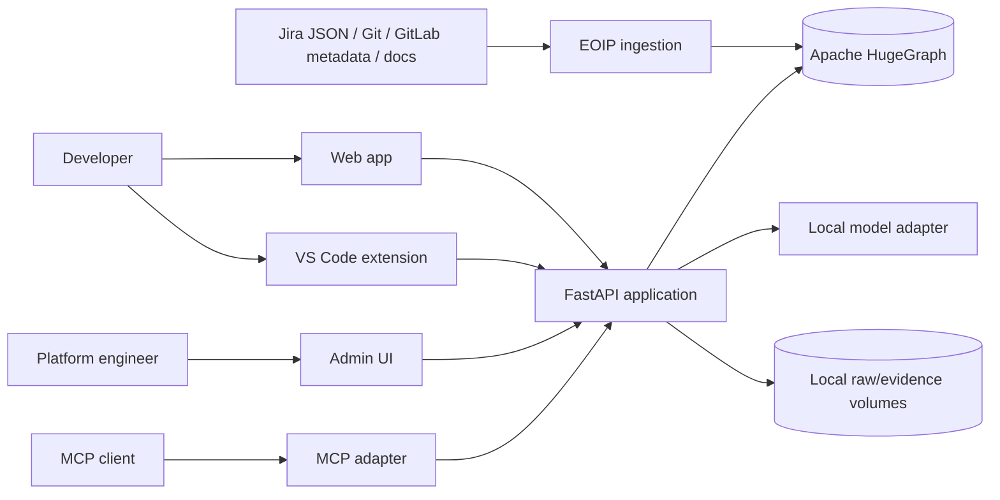

# 01-system-context

```mermaid
graph LR
  Sources[Jira JSON / Git / GitLab metadata / docs] --> Ingest[EOIP ingestion]
  Dev[Developer] --> Web[Web app]
  Dev --> VS[VS Code extension]
  Admin[Platform engineer] --> AdminUI[Admin UI]
  Web --> API[FastAPI application]
  AdminUI --> API
  VS --> API
  MCPClient[MCP client] --> MCP[MCP adapter]
  MCP --> API
  API --> HG[(Apache HugeGraph)]
  Ingest --> HG
  API --> LM[Local model adapter]
  API --> Raw[(Local raw/evidence volumes)]
```
