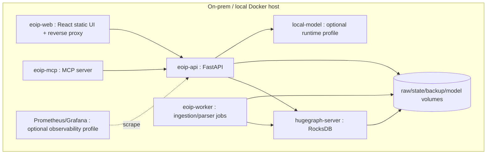

# 02-container-architecture

```mermaid
graph TB
  subgraph Host[On-prem / local Docker host]
    Edge[eoip-web : React static UI + reverse proxy]
    API[eoip-api : FastAPI]
    Worker[eoip-worker : ingestion/parser jobs]
    MCP[eoip-mcp : MCP server]
    HG[hugegraph-server : RocksDB]
    Model[local-model : optional runtime profile]
    Obs[Prometheus/Grafana : optional observability profile]
    Vol[(raw/state/backup/model volumes)]
  end
  Edge --> API
  API --> HG
  Worker --> HG
  Worker --> Vol
  API --> Vol
  MCP --> API
  API --> Model
  Obs -. scrape .-> API
  HG --> Vol
```
