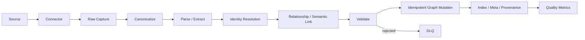

# 03-ingestion-pipeline

```mermaid
flowchart LR
 S[Source] --> C[Connector] --> R[Raw Capture] --> N[Canonicalize]
 N --> P[Parse / Extract] --> I[Identity Resolution] --> L[Relationship / Semantic Link]
 L --> V[Validate] --> M[Idempotent Graph Mutation] --> X[Index / Meta / Provenance]
 X --> Q[Quality Metrics]
 V -->|rejected| D[DLQ]
```
