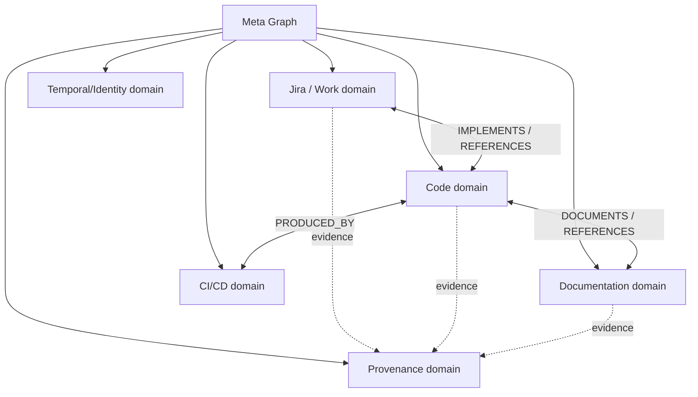

# 04-enterprise-graph-architecture

```mermaid
graph TB
 M[Meta Graph] --> J[Jira / Work domain]
 M --> C[Code domain]
 M --> D[Documentation domain]
 M --> CI[CI/CD domain]
 M --> P[Provenance domain]
 M --> T[Temporal/Identity domain]
 J <-->|IMPLEMENTS / REFERENCES| C
 C <-->|PRODUCED_BY| CI
 C <-->|DOCUMENTS / REFERENCES| D
 J -. evidence .-> P
 C -. evidence .-> P
 D -. evidence .-> P
```
