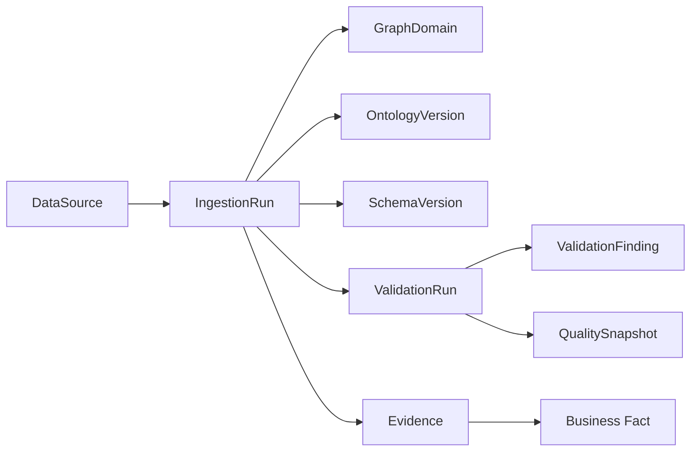

# 05-meta-graph

```mermaid
graph LR
 DS[DataSource] --> IR[IngestionRun]
 IR --> GD[GraphDomain]
 IR --> OV[OntologyVersion]
 IR --> SV[SchemaVersion]
 IR --> VR[ValidationRun]
 VR --> VF[ValidationFinding]
 VR --> QS[QualitySnapshot]
 IR --> EV[Evidence]
 EV --> FACT[Business Fact]
```
