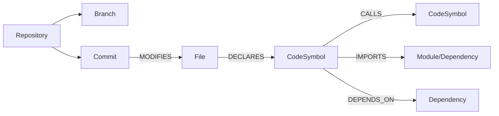

# 06-code-graph

```mermaid
graph LR
 R[Repository] --> B[Branch]
 R --> C[Commit]
 C -->|MODIFIES| F[File]
 F -->|DECLARES| S[CodeSymbol]
 S -->|CALLS| S2[CodeSymbol]
 S -->|IMPORTS| M[Module/Dependency]
 S -->|DEPENDS_ON| D[Dependency]
```
