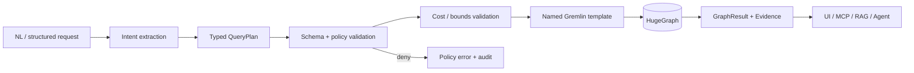

# 08-query-execution

```mermaid
flowchart LR
 U[NL / structured request] --> I[Intent extraction]
 I --> P[Typed QueryPlan]
 P --> S[Schema + policy validation]
 S --> C[Cost / bounds validation]
 C --> G[Named Gremlin template]
 G --> H[(HugeGraph)]
 H --> E[GraphResult + Evidence]
 E --> A[UI / MCP / RAG / Agent]
 S -->|deny| D[Policy error + audit]
```
