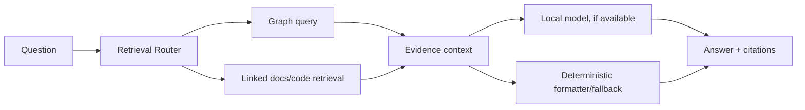

# 09-graphrag

```mermaid
flowchart LR
 Q[Question] --> R[Retrieval Router]
 R --> G[Graph query]
 R --> D[Linked docs/code retrieval]
 G --> C[Evidence context]
 D --> C
 C --> L[Local model, if available]
 C --> F[Deterministic formatter/fallback]
 L --> O[Answer + citations]
 F --> O
```
