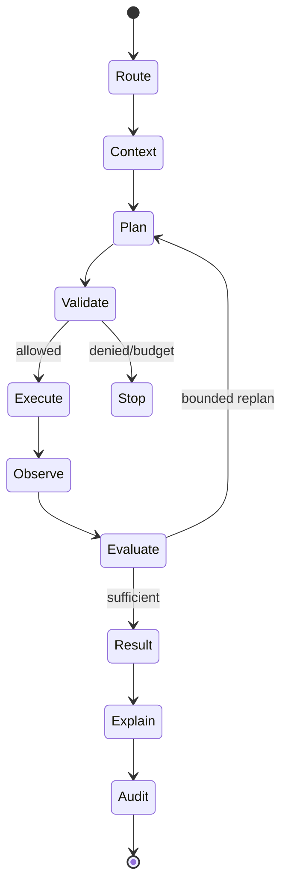

# 10-agent-runtime

```mermaid
stateDiagram-v2
 [*] --> Route
 Route --> Context
 Context --> Plan
 Plan --> Validate
 Validate --> Execute: allowed
 Validate --> Stop: denied/budget
 Execute --> Observe
 Observe --> Evaluate
 Evaluate --> Plan: bounded replan
 Evaluate --> Result: sufficient
 Result --> Explain
 Explain --> Audit
 Audit --> [*]
```
