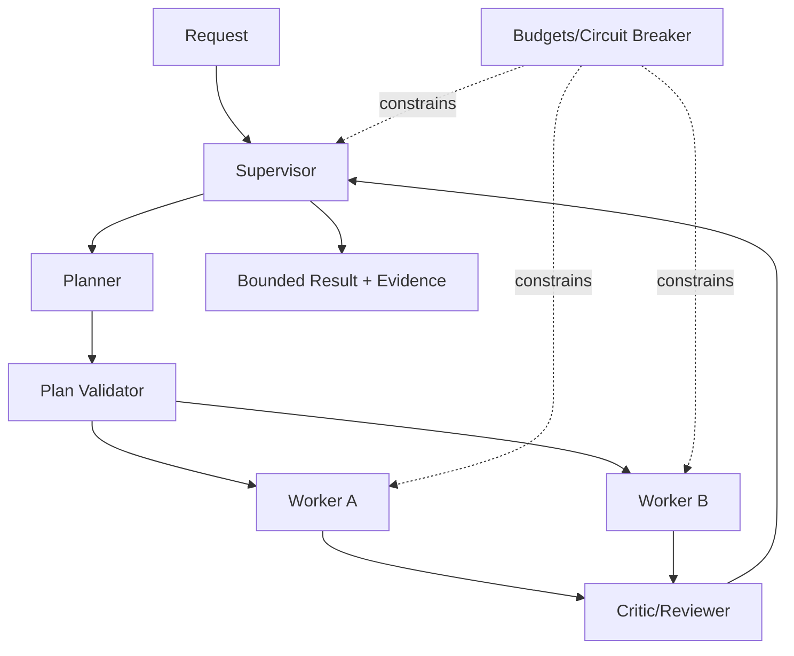

# 11-multi-agent-orchestration

```mermaid
flowchart TB
 R[Request] --> S[Supervisor]
 S --> P[Planner]
 P --> V[Plan Validator]
 V --> W1[Worker A]
 V --> W2[Worker B]
 W1 --> C[Critic/Reviewer]
 W2 --> C
 C --> S
 S --> O[Bounded Result + Evidence]
 G[Budgets/Circuit Breaker] -. constrains .-> S
 G -. constrains .-> W1
 G -. constrains .-> W2
```
