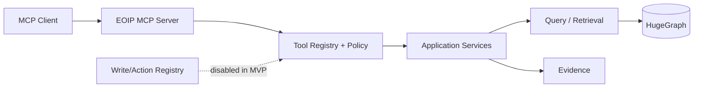

# 12-mcp-architecture

```mermaid
graph LR
 Client[MCP Client] --> Server[EOIP MCP Server]
 Server --> Policy[Tool Registry + Policy]
 Policy --> Services[Application Services]
 Services --> Q[Query / Retrieval]
 Q --> HG[(HugeGraph)]
 Services --> Ev[Evidence]
 W[Write/Action Registry] -. disabled in MVP .-> Policy
```
