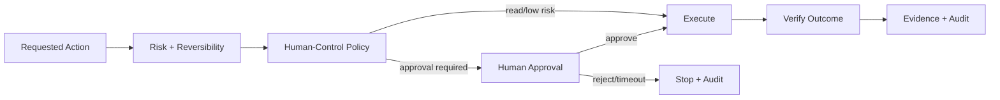

# 13-human-control-architecture

```mermaid
flowchart LR
 Req[Requested Action] --> Risk[Risk + Reversibility]
 Risk --> P[Human-Control Policy]
 P -->|read/low risk| Exec[Execute]
 P -->|approval required| H[Human Approval]
 H -->|approve| Exec
 H -->|reject/timeout| Stop[Stop + Audit]
 Exec --> Verify[Verify Outcome]
 Verify --> Audit[Evidence + Audit]
```
