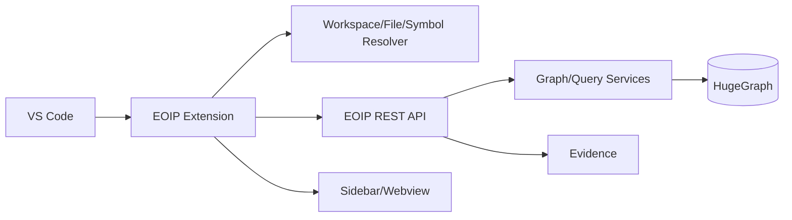

# 15-vscode-architecture

```mermaid
graph LR
 VS[VS Code] --> Ext[EOIP Extension]
 Ext --> Ctx[Workspace/File/Symbol Resolver]
 Ext --> API[EOIP REST API]
 API --> Graph[Graph/Query Services]
 Graph --> HG[(HugeGraph)]
 API --> Ev[Evidence]
 Ext --> View[Sidebar/Webview]
```
