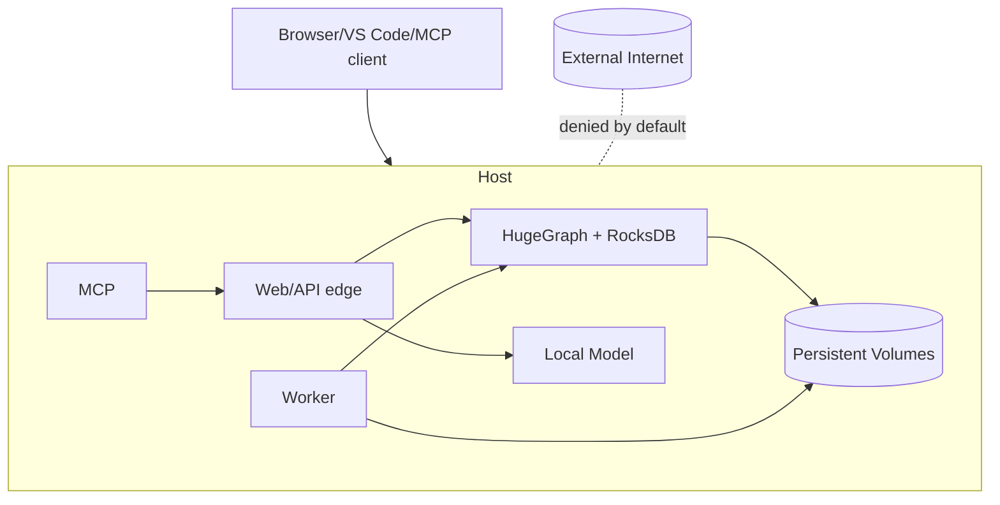

# 16-deployment

```mermaid
graph TB
 User[Browser/VS Code/MCP client] --> Host[On-prem Docker Host]
 subgraph Host
   Web[Web/API edge]
   Worker[Worker]
   MCP[MCP]
   HG[HugeGraph + RocksDB]
   LM[Local Model]
   V[(Persistent Volumes)]
 end
 Web --> HG
 Worker --> HG
 MCP --> Web
 Web --> LM
 HG --> V
 Worker --> V
 Internet[(External Internet)] -. denied by default .- Host
```
