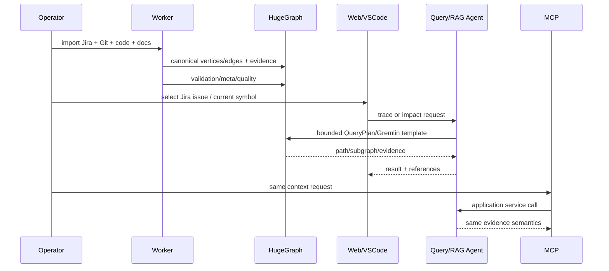

# 17-mvp-e2e-flow

```mermaid
sequenceDiagram
 participant O as Operator
 participant W as Worker
 participant H as HugeGraph
 participant U as Web/VSCode
 participant A as Query/RAG Agent
 participant M as MCP
 O->>W: import Jira + Git + code + docs
 W->>H: canonical vertices/edges + evidence
 W->>H: validation/meta/quality
 O->>U: select Jira issue / current symbol
 U->>A: trace or impact request
 A->>H: bounded QueryPlan/Gremlin template
 H-->>A: path/subgraph/evidence
 A-->>U: result + references
 O->>M: same context request
 M->>A: application service call
 A-->>M: same evidence semantics
```
